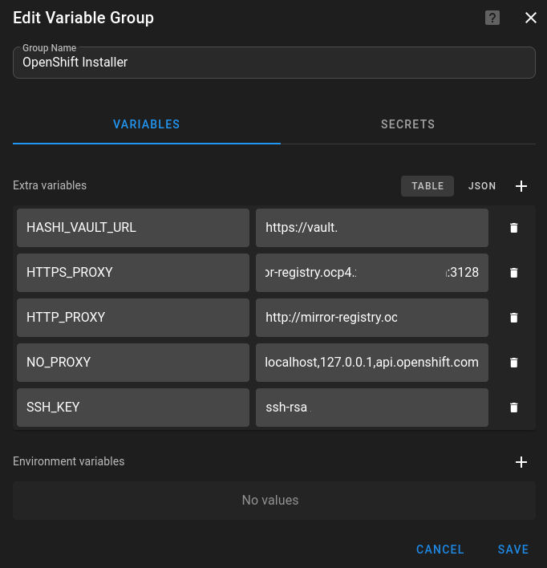
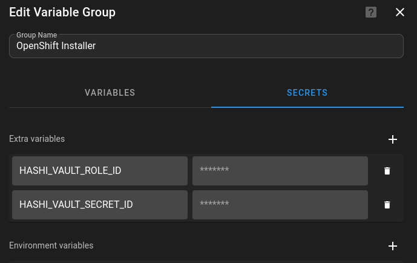
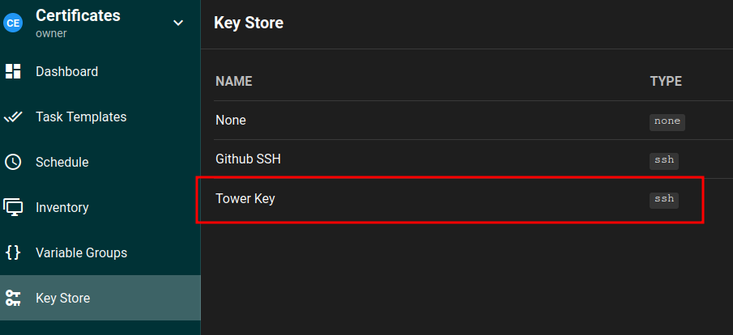
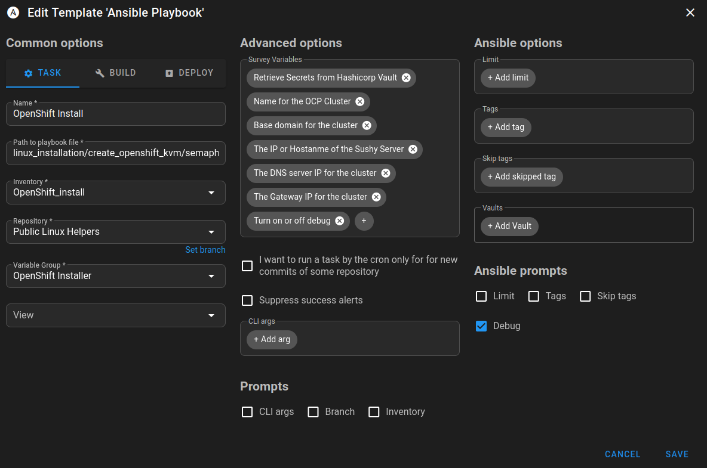

This repo holds playbooks and roles related to the standing up and tearing down of an OpenShift cluster using KVM.
This assumes RHEL hosts for the KVM host, but in theory should work for other distributions. 

For DNS, I made the role for pfSense, although this should be easy to swap out for the backend of your choice.

Sushy-tools is installed to provide the RedFish functionality for BMC emulation for KVM. 


The templates directory has templates for VMs using legacy boot mode as opposed to UEFI. Edit the `vm_template.xml.j2` if you wish to change this. In addition, the `install-config.yaml` is a basic version of a baremetal installation. It assumes that the first network device will be used for installation purpose. At this time, the value `enp1s0` is assumed to be the first interface but there may be a predictive naming task(s) implemented in the future.

> [!NOTE]
> I am assuming hashicorp vault open source edition is available to store a versioned copy of the `install-config.yaml` so that you can reference it in the future.


# OpenShift on KVM Automation

This section of the repository provides Ansible playbooks and supporting files to automate the installation of an OpenShift cluster on top of KVM (Kernel-based Virtual Machine). The automation is designed for advanced users who want to deploy OpenShift in a virtualized environment, leveraging KVM, libvirt, and optionally integrating with HashiCorp Vault for secrets management.

## Features

- Automated provisioning of OpenShift control plane and worker VMs on KVM/libvirt.
- Dynamic generation of OpenShift `install-config.yaml` with support for advanced networking (VLANs, bonding).
- Integration with HashiCorp Vault for secure retrieval and storage of secrets (pull secrets, SSH keys, certificates).
- Optional DNS configuration for OpenShift endpoints (currently only supporting pfSense).
- Automated download and installation of the correct OpenShift binaries.
- Support for Redfish virtual media (via sushy-tools) for baremetal-style provisioning.
- Modular roles for VM creation, network setup, DNS, and more.

## Directory Structure

- `vars.yaml` - Main variable file for cluster/network configuration.
- `semaphore_create_kvm_openshift.yaml` - Main Ansible playbook to orchestrate the deployment via [Semaphore UI](https://github.com/semaphoreui/semaphore).
- `create_kvm_openshift.yaml` - This playbook was originally designed to be run from the KVM host.
- `roles/` - Ansible roles for VM creation, Vault integration, DNS, etc.
- `templates/` - Jinja2 templates for VM XML, install-config, and systemd services.

## Prerequisites

- A KVM/libvirt host (RHEL/CentOS/AlmaLinux/Rocky or similar). You can use the `rhel_virtualization` [playbooks](https://github.com/stratus-ss/linux-helpers/tree/main/linux_installation/rhel_virtualization) to create a virt host that supports nested virtualization required.
- Ansible 2.9+ and required collections (`community.libvirt`, `community.hashi_vault`, etc). See [requirements.yml](https://github.com/stratus-ss/linux-helpers/blob/main/requirements.yml) for more info.
- Access to OpenShift release images and pull secrets.
- (Optional) [HashiCorp Vault](https://github.com/hashicorp/vault) for secrets management.
- (Optional) A DNS server (e.g., pfSense) for automated DNS setup.

## Quick Start (Traditional Ansible)

1. **Clone the repository** and navigate to this directory.

2. **Edit `vars.yaml`** to match your environment (IP addresses, domain, network, etc).

3. **(Optional) Configure Vault** credentials in `vars.yaml` if using secrets from Vault.

4. **Run the playbook**:

   ```bash
   ansible-playbook -i <your_inventory> create_kvm_openshift.yaml
   ```

## Semaphore Setup

Due to the weight and complexity of maintenance, while AAP or AWX was used in the past, I did not want to run kubernetes just to have a wrapper around my playbooks. Therefore I sought out lighter weight alternatives. Currently I am aware of  [Ansible WebUI](https://github.com/O-X-L/ansible-webui) and [Semaphore UI](https://github.com/semaphoreui/semaphore). I chose to setup Semaphore for the time being.

In order to convert my OpenShift Installation playbook to work with Semaphore UI I needed to make the following changes:

### File Layout

These files are nested on [github](https://github.com/stratus-ss/linux-helpers/tree/main/linux_installation/create_openshift_kvm). The original playbook (more or less) is `create_kvm_openshift`. However, given that Semaphore does not support using a vars file, I added some tasks embeding the variables directly in the playbook itself by setting facts. This is because, while you can set varialbes in `json` format in Semaphore, it doesn't support creating one variable from another such as `HASHI_VAULT_PATH: configs/data/{{ CLUSTER_NAME }}.{{ BASE_DOMAIN }}`. 

The variables that are defined in Semaphore function as `extra-vars` meaning they have the highest precedence. This allowed me to check in a generate version of variables and override ones specific to my environment:



In addition, I am using the following inventory in Semaphore

```
[all]
localhost 

[kvm]
kvm-host.example.com

[dns]
pfsense ansible_host=pfsense.example.com

[dns:vars]
ansible_ssh_user=admin
ansible_python_interpreter=/usr/local/bin/python3.11
ansible_pipelining=true

[bastion]
bastion.example.com
```

Finally, I am using the `Key Store` in Semaphore to store the SSH key I will use to connect to hosts in this playbook



### Semaphore Task Template

I am using "Survey" variables in order to override values coded into the playbook. My Template looks like this (all survey variables are marked as required):




The survey variable names are as follows
| **Variable Name** | **Type** | **Value** |
|----|----|----|
| RETRIEVE_FROM_VAULT | String | true |
| CLUSTER_NAME | String | one |
| BASE_DOMAIN | String | ocp4.example.com |
| SUSHY_SERVER | String | 10.0.1.1 |
| DNS_NAMESERVER | String | 10.0.1.7|
| NETWORK_GATEWAY | String | 10.0.1.7 |
| DEBUG | String | false |

