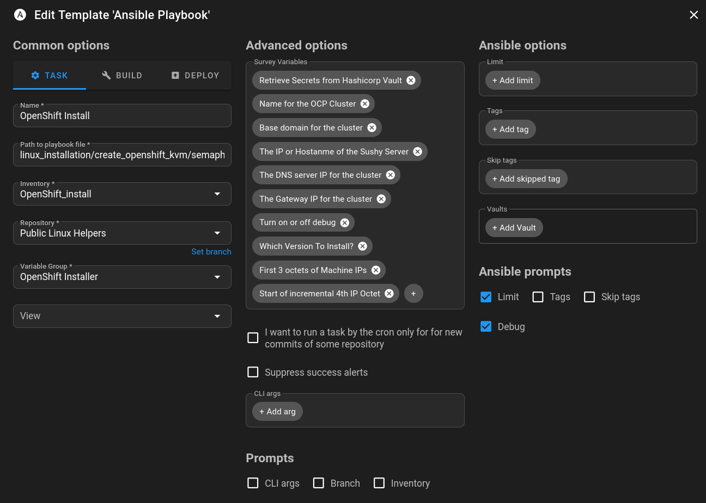

# OpenShift on KVM Automation

This section of the repository provides Ansible playbooks and supporting files to automate the installation of an OpenShift cluster on top of KVM (Kernel-based Virtual Machine). The automation is designed for advanced users who want to deploy OpenShift in a virtualized environment, leveraging KVM, libvirt, and optionally integrating with HashiCorp Vault for secrets management.

This assumes RHEL hosts for the KVM host, but in theory should work for other distributions.

For DNS, I made the role for pfSense, although this should be easy to swap out for the backend of your choice.

Sushy-tools is installed to provide the RedFish functionality for BMC emulation for KVM.

The templates directory has templates for VMs using legacy boot mode as opposed to UEFI. Edit the vm_template.xml.j2 if you wish to change this. In addition, the install-config.yaml is a basic version of a baremetal installation. It assumes that the first network device will be used for installation purpose. At this time, the value enp1s0 is assumed to be the first interface but there may be a predictive naming task(s) implemented in the future.


> [!NOTE]
> I am assuming hashicorp vault open source edition is available to store a versioned copy of the `install-config.yaml` so that you can reference it in the future.


## 🚀 Recent Improvements (Aug 2025)

- **🔧 Major Code Refactoring**: Eliminated 130+ lines of duplicate configuration through dynamic parameter generation
- **📊 Flexible Configuration**: Support for multiple cluster configurations using Ansible extra-vars
- **🎯 Examples Library**: Comprehensive configuration examples for different environments (prod, dev, edge)
- **⚡ Performance Optimizations**: Consolidated vault operations and improved task efficiency
- **🔒 Enhanced Security**: Better variable management and secrets handling
- **🧪 Testing Framework**: Built-in demonstration and validation tools

## Features

### Core Functionality
- **Automated VM Provisioning**: Dynamic creation of OpenShift control plane and worker VMs on KVM/libvirt
- **IP Management**: Automatic IP address assignment with configurable network ranges
- **Dynamic Configuration**: Generate cluster parameters automatically based on node lists and network settings
- **Multi-Environment Support**: Single playbook works for development, staging, and production clusters
- **Variable Override System**: Flexible configuration using Ansible extra-vars
- **Template-Based Deployment**: Jinja2 templates for VM XML, install-config, and services
- **Modular Architecture**: Reusable roles for VM creation, network setup, DNS, and more
- **Cluster Lifecycle Management**: Complete deployment and destruction workflows

### Advanced Integration
- **HashiCorp Vault Integration**: Secure retrieval and storage of secrets (pull secrets, SSH keys, certificates)
- **DNS Automation**: Optional DNS configuration for OpenShift endpoints (currently supporting pfSense)
- **Binary Management**: Automated download and installation of correct OpenShift binaries
- **Redfish Support**: Virtual media provisioning via sushy-tools for baremetal-style deployment

## Directory Structure

```
create_openshift_kvm/
├── README.md                              # This file
├── REFACTORING_CHECKLIST.md              # Development and improvement tracking
├── vars.yaml                             # Default variable configuration
├── semaphore_create_kvm_openshift.yaml   # Main playbook (Semaphore UI compatible)
├── create_install_config.yaml            # Standalone install-config generator
├── destroy_cluster.yaml                  # Cluster teardown playbook
├── convert_vars.py                       # Utility for YAML/JSON conversion
├── inventory                             # Sample inventory file
├── examples/                             # 🆕 Configuration examples and demos
│   ├── README.md                         # Examples documentation
│   ├── production-cluster-override.yaml  # Production cluster configuration
│   ├── development-cluster-override.yaml # Development cluster configuration
│   ├── edge-cluster-override.json        # Edge computing configuration
│   ├── test-cluster-inline.sh            # Command-line example
│   └── demonstrate-ip-calculation.yaml   # IP calculation demo
├── roles/                                # Ansible roles
│   ├── create_kvm_guest/                 # VM creation and management
│   ├── get_network_interfaces/           # Network interface detection
│   ├── vault_read_storage/               # HashiCorp Vault operations
│   ├── vault_write_storage/              # Vault data storage
│   ├── openshift_install_config/         # Install configuration generation
│   ├── download_ocp_binaries/            # OpenShift binary management
│   ├── dns_settings_pfsense/             # pfSense DNS automation
│   ├── sushy_tools_setup/                # Redfish/BMC emulation
│   ├── bastion_libvirt/                  # Bastion host configuration
│   └── delete_vms/                       # VM cleanup and removal
├── templates/                            # Jinja2 templates
│   ├── vm_template.xml.j2                # KVM VM definition
│   ├── install-config.yaml.j2            # OpenShift install configuration
│   └── sushy_tools.service.j2            # Systemd service template
└── images/                               # Documentation screenshots
    ├── openshift_installer_vg1.png
    ├── openshift_installer_vg2.png
    ├── semaphore_keystore.png
    └── semaphore_template_options.png
```

## Prerequisites

### Infrastructure Requirements
- **KVM/libvirt host**: RHEL/CentOS/AlmaLinux/Rocky or similar distribution
  - Use the [rhel_virtualization playbooks](https://github.com/stratus-ss/linux-helpers/tree/main/linux_installation/rhel_virtualization) to setup a virt host with nested virtualization
- **Sufficient resources**: RAM and CPU to support your cluster size
- **Network connectivity**: Access to OpenShift release images and container registries

### Software Requirements
- **Ansible 2.9+** with required collections:
  - `community.libvirt`
  - `community.hashi_vault`  
  - `ansible.posix`
  - See [requirements.yml](https://github.com/stratus-ss/linux-helpers/blob/main/requirements.yml) for complete list
- **OpenShift pull secret**: Access to Red Hat container registries
- **SSH key pair**: For cluster node access

### Optional Components
- **[HashiCorp Vault](https://github.com/hashicorp/vault)**: For enterprise secrets management
- **DNS server**: Currently supports pfSense for automated DNS configuration
- **Proxy server**: For environments requiring HTTP/HTTPS proxy access

## 🎯 Quick Start: Multiple Cluster Configurations

### Method 1: Using Configuration Files (Recommended)

The `examples/` directory contains pre-configured templates for different environments:

```bash
# Production cluster
ansible-playbook semaphore_create_kvm_openshift.yaml \
  --extra-vars @examples/production-cluster-override.yaml

# Development cluster  
ansible-playbook semaphore_create_kvm_openshift.yaml \
  --extra-vars @examples/development-cluster-override.yaml

# Edge computing cluster
ansible-playbook semaphore_create_kvm_openshift.yaml \
  --extra-vars @examples/edge-cluster-override.json
```

### Method 2: Inline Variable Override

```bash
# Custom cluster with inline variables
ansible-playbook semaphore_create_kvm_openshift.yaml \
  --extra-vars "CLUSTER_NAME=test" \
  --extra-vars "BASE_DOMAIN=test.lab.local" \
  --extra-vars "MACHINE_IP_BASE=172.16.100" \
  --extra-vars "API_VIP=172.16.100.10"
```

### Method 3: Traditional Approach

1. **Edit `vars.yaml`** to match your environment
2. **Run the playbook**:
   ```bash
   ansible-playbook -i inventory semaphore_create_kvm_openshift.yaml
   ```

## 🔧 Dynamic Configuration System

### How It Works

The playbook now uses **dynamic parameter generation** instead of hardcoded configurations. This means:

- **Automatic IP assignment**: IPs are calculated based on `MACHINE_IP_BASE` and node indices
- **Scalable node lists**: Add/remove nodes by updating `CONTROL_PLANE_NAMES` and `WORKER_NAMES`
- **Single source of truth**: Modify cluster parameters in one place
- **Environment flexibility**: Same playbook works for any environment with variable overrides

### Key Variables for Override

| Variable | Purpose | Example |
|----------|---------|---------|
| `CLUSTER_NAME` | Cluster identifier | `"production"` |
| `BASE_DOMAIN` | DNS domain | `"prod.company.com"` |
| `MACHINE_IP_BASE` | IP network base | `"10.50.100"` |
| `MACHINE_IP_START` | Starting IP offset | `10` |
| `CONTROL_PLANE_NAMES` | Master node names | `["prod-cp1", "prod-cp2", "prod-cp3"]` |
| `WORKER_NAMES` | Worker node names | `["prod-worker1", "prod-worker2"]` |
| `API_VIP` | API load balancer IP | `"10.50.100.5"` |
| `APP_VIP` | Apps load balancer IP | `"10.50.100.6"` |

### Example: IP Calculation

```yaml
# Configuration
MACHINE_IP_BASE: "10.50.100"
MACHINE_IP_START: 10
CONTROL_PLANE_NAMES: ["prod-cp1", "prod-cp2", "prod-cp3"]
WORKER_NAMES: ["prod-worker1", "prod-worker2"]

# Generated IPs
# prod-cp1.production.prod.company.com -> 10.50.100.10
# prod-cp2.production.prod.company.com -> 10.50.100.11  
# prod-cp3.production.prod.company.com -> 10.50.100.12
# prod-worker1.production.prod.company.com -> 10.50.100.13
# prod-worker2.production.prod.company.com -> 10.50.100.14
```

## Semaphore UI Integration

### Overview

This automation integrates with [Semaphore UI](https://github.com/semaphoreui/semaphore) for web-based deployment management. Semaphore provides a lightweight alternative to AWX/Ansible Automation Platform.

### Key Differences from Traditional Ansible

1. **Embedded Variables**: Variables are defined in the playbook using `set_fact` to support Semaphore's limitations
2. **Survey Variables**: Use Semaphore's survey feature for runtime variable collection
3. **Extra-vars Priority**: Leverage Ansible's variable precedence for environment-specific overrides

Semaphore does not support using a vars file, I added some tasks embeding the variables directly in the playbook itself by setting facts. This is because, while you can set varialbes in json format in Semaphore, it doesn't support creating one variable from another such as `HASHI_VAULT_PATH: configs/data/{{ CLUSTER_NAME }}.{{ BASE_DOMAIN }}`.

### File Layout Changes

- **`semaphore_create_kvm_openshift.yaml`**: Main playbook with embedded variables for Semaphore compatibility
- **Survey variables**: Collected at runtime through Semaphore's web interface
- **Variable precedence**: Extra-vars (highest) → set_fact → vars.yaml (lowest)

The variables that are defined in Semaphore function as `extra-vars` meaning they have the highest precedence. This allowed me to check in a generate version of variables and override ones specific to my environment:


In addition, I am using the following inventory in Semaphore

```ini
[all]
localhost 

[kvm]
kvm-host.example.com

[dns]
pfsense ansible_host=pfsense.example.com

[dns:vars]
ansible_ssh_user=admin
ansible_python_interpreter=/usr/local/bin/python3.11
ansible_pipelining=true

[bastion]
bastion.example.com
```

### Required Survey Variables

| Variable Name | Type | Description |
|---------------|------|-------------|
| `BASE_DOMAIN` | String | DNS domain for cluster |
| `CLUSTER_NAME` | String | Cluster identifier |
| `DEBUG` | String | Enable debug output (`true`/`false`) |
| `DNS_NAMESERVER` | String | DNS server for cluster nodes |
| `MACHINE_IP_BASE`| String |The first 3 IP octets (i.e. `192.168.0`)|
| `MACHINE_IP_START`| String |The 4th IP octet|
| `NETWORK_GATEWAY` | String | Network gateway for cluster |
| `OPENSHIFT_VERSION`| String | The version of OCP to install (i.e. `4.18.14`)|
| `RETRIEVE_FROM_VAULT` | String | Enable Vault integration (`true`/`false`) |
| `SUSHY_SERVER` | String | Redfish BMC emulation server IP |


I am using "Survey" variables in order to override values coded into the playbook. My Template looks like this (all survey variables are marked as required):



### Key Store Configuration

Finally, I am using the `Key Store` in Semaphore to store the SSH key I will use to connect to hosts in this playbook


## Advanced Usage

### Custom Resource Profiles

```bash
# High-performance cluster
ansible-playbook semaphore_create_kvm_openshift.yaml \
  --extra-vars "VM_RAM_MB=65536" \
  --extra-vars "VM_vCPUS=16"

# Resource-constrained environment  
ansible-playbook semaphore_create_kvm_openshift.yaml \
  --extra-vars "VM_RAM_MB=8192" \
  --extra-vars "VM_vCPUS=2"
```

### Network Configuration

```bash
# VLAN-enabled cluster
ansible-playbook semaphore_create_kvm_openshift.yaml \
  --extra-vars '{"VLANS": {"enabled": true, "machine_vlan_id": "100"}}'

# Proxy environment
ansible-playbook semaphore_create_kvm_openshift.yaml \
  --extra-vars "HTTPS_PROXY=http://proxy.company.com:8080" \
  --extra-vars "HTTP_PROXY=http://proxy.company.com:8080"
```

### Cluster Scaling

```bash
# Large production cluster
ansible-playbook semaphore_create_kvm_openshift.yaml \
  --extra-vars '{"WORKER_NAMES": ["worker1", "worker2", "worker3", "worker4", "worker5", "worker6"]}' \
  --extra-vars "NUMBER_OF_WORKER_VMS=6"

# Compact cluster (masters only)
ansible-playbook semaphore_create_kvm_openshift.yaml \
  --extra-vars "NUMBER_OF_WORKER_VMS=0"
```

## Troubleshooting and Testing

### Validate Configuration

Use the demonstration playbook to test IP calculation and configuration:

```bash
cd examples/
ansible-playbook demonstrate-ip-calculation.yaml \
  --extra-vars "CLUSTER_NAME=test" \
  --extra-vars "MACHINE_IP_BASE=10.20.30"
```

### Common Issues

1. **IP conflicts**: Ensure `MACHINE_IP_BASE` ranges don't overlap with existing infrastructure
2. **Resource constraints**: Verify KVM host has sufficient RAM/CPU for cluster size
3. **Network connectivity**: Check access to OpenShift registries and proxy settings
4. **Vault connectivity**: Validate HashiCorp Vault credentials and network access

### Debug Mode

Enable debug output for detailed troubleshooting:

```bash
ansible-playbook semaphore_create_kvm_openshift.yaml \
  --extra-vars "DEBUG=true" \
  -vvv
```

## Cluster Lifecycle Management

### Deployment

```bash
# Full cluster deployment
ansible-playbook semaphore_create_kvm_openshift.yaml \
  --extra-vars @examples/production-cluster-override.yaml
```

### DNS Configuration

```bash
# Configure DNS entries (requires pfSense)
ansible-playbook create_dns.yaml \
  --extra-vars "create_dns=true"
```

### Cleanup and Destruction

```bash
# Destroy cluster and cleanup resources
ansible-playbook destroy_cluster.yaml \
  --extra-vars "destroy_cluster=true"
```

## Security Considerations

### HashiCorp Vault Integration

This automation supports HashiCorp Vault for secure secrets management:

- **Pull secrets**: OpenShift container registry credentials
- **SSH keys**: Cluster node access keys  
- **Certificates**: Additional trust bundles and certificates
- **Install config**: Versioned storage of cluster configuration

### Best Practices

1. **Use Vault**: Store sensitive information in HashiCorp Vault rather than plain text
2. **Network segmentation**: Isolate cluster networks from production infrastructure
3. **Access control**: Implement proper SSH key management and access controls
4. **Regular updates**: Keep OpenShift versions and base images current

## Contributing and Development

### Refactoring Status

See [REFACTORING_CHECKLIST.md](REFACTORING_CHECKLIST.md) for ongoing improvement tracking and completed optimizations.

### Architecture Notes

- **Legacy boot mode**: VMs use BIOS/legacy boot by default (configurable in `vm_template.xml.j2`)
- **First interface assumption**: Playbook assumes `enp1s0` as primary interface (may be updated for predictive naming)
- **pfSense DNS**: Currently only supports pfSense for automated DNS configuration
- **Redfish emulation**: Uses sushy-tools for BMC functionality required by OpenShift baremetal installer

### Future Enhancements

- Support for additional DNS providers beyond pfSense
- UEFI boot mode templates
- Predictive network interface naming
- Multi-cluster deployment coordination
- Enhanced monitoring and logging integration

## License and Support

This project is part of the [linux-helpers](https://github.com/stratus-ss/linux-helpers) repository. Please refer to the main repository for license information and support channels.

For issues specific to OpenShift KVM automation, please include:
- Ansible version and collection versions
- KVM/libvirt host details  
- Network configuration
- Error messages and logs (with sensitive information redacted)

---

**Note**: This automation assumes advanced knowledge of OpenShift, KVM/libvirt, and Ansible. Ensure you understand the implications of the deployment before running in production environments.